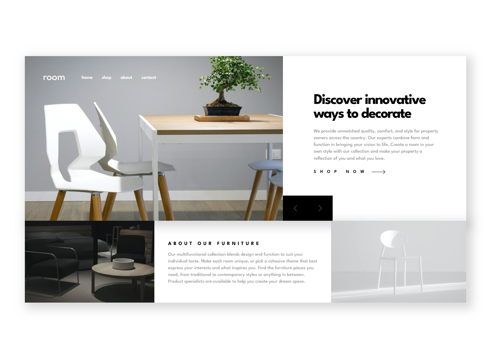
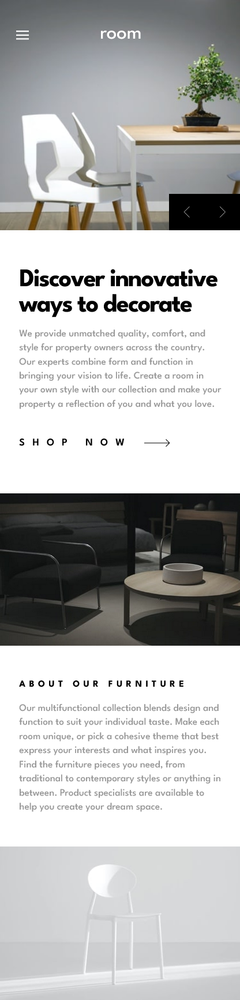

# Frontend Mentor - Solução para a página inicial responsiva

Esta é uma solução para o [Room homepage challenge on Frontend Mentor](https://www.frontendmentor.io/challenges/room-homepage-BtdBY_ENq). 

## Visão Geral

### O Desafio

Os usuários devem ser capazes de:

- Visualizar o layout otimizado do site, dependendo do tamanho da tela do seu dispositivo
- Ver estados de sobreposição para todos os elementos interativos na página
- Navegar pelo slider usando o mouse/trackpad ou teclado

### Imagens

### Links

- URL da Solução: [Front-end Mentor](https://www.frontendmentor.io/solutions/responsive-homepage-using-tailwind-and-bem-methodology-TqphdaRQLT)
- URL do Site Ao Vivo: [Vercel](https://homepage-challenge-beta.vercel.app/)

## Meu processo

### Desenvolvido com

- Marcação HTML5 Semântica
- Propriedades personalizadas CSS
- Flexbox
- Grid
- Tailwind css
- SASS
- [React](https://reactjs.org/) - React com Javascript

### O que aprendi

#### SASS e Arquitetura BEM 

Consegui aprimorar um pouco minhas habilidades com o SASS e aprendi a organizar mais meus estilos utilizando a arquitetura BEM (Block, Element, Modifier).
Também foi o primeiro desafio que fiz seguindo os padrões Pixel Perfect (Embora o layout não tenha ficado exatamente preciso de acordo com os previews), foi
o mais próximo que consegui do que foi pedido.

## Autor

- Linkedin - [@juan-gabriel-sa](https://www.linkedin.com/in/juan-gabriel-sa/)
